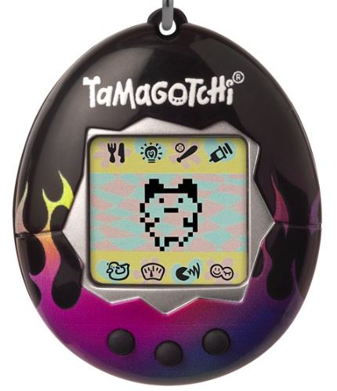

## Inleiding

Welkom bij de tweede opdracht van de Summerschool. Deze opdracht gaat over een digital animal.
## Opdrachtbeschrijving

In het verleden was het een mega hype, iedereen had er een. Het was niet meer als een digitaal diertje, waar voor gezorgd moest worden. Voor deze opdracht ga je er een versie van maken.

## Randvoorwaarden

De applicatie moet voldoen aan het volgende:

- 2 `Superklassen`;
- 5 `klassen` (incl. `Superklassen`;
- Een _Main_-`klasse` met een _main_-`methode`;
- 2 `Enums`;
- 1 `static` `methode`;
- verschillende `final` `variabelen`.

## Stappenplan
Het is uitdagender om jouw eigen stappenplan te maken, maar als je niet weet waar je wil beginnen kun je dit stappenplan volgen.
1. Maak een _Main_-`klasse` aan in de `src`-map.
2. Maak vervolgens binnen de _main_-`klasse` een _main_-`methode` aan. Anders kun je de applicatie niet draaien!
3. Maak een `Enum` aan voor _Gender_, geef deze de volgende waardes:
- FEMALE;
- MALE;
- OTHER.
4. Maak een `Enum` aan voor _Species_, geef deze de volgende waardes:
- BIRD;
- FISH;
- CAT;
- DOG.
5. Maak een _DigitalAnimal_ `klasse` aan.
6. In de _DigitalAnimal_ `klasse` maken we `variabelen` aan voor:
- `String` _name_;
- `Species` _species_;
- `int` _foodBar_;
- `Gender` _gender_;
- `int` _age_;
- `int` _attentionBar_.
5. Maak een gevulde `constructor` waar alle `variabelen `als `attribuut` worden meegegeven in de _DigitalAnimal_ `klasse`.
6. Geef elk `private` `variabele` een `public` `getter` en `setter`.
7. Geef de _foodBar_ en de _attentionBar_ in de `constructor` een vaste waarde van 40, maak deze `variabelen` `final` en verwijder de `setter` van de `variabele`.
8. Doe dit ook voor de _age_ met de waarde 0. Dit omdat een nieuw object van de klasse altijd zal beginnen met de leeftijd van 0 dagen, maar de `variabale` hoeft in dit geval niet final gemaakt te worden en we hoeven de setter niet te verwijderen.
9. Maak een nieuwe `klasse` aan genaamd _Food_.
10. Geef _Food_ de `private` `variabelen`:
- _hamburger_ met de waarde 40;
- _candy_ met de waarde 5;
11. Maak deze `variabelen` `private final` en geef de `klasse` de juiste `getters.
12. Maak een niewe `klasse` aan met de naam _Feed_, dit wordt een `abstracte klasse` en `extends` de klasse _Food_.
13. Maak in de _Feed_ een methode genaamd _feedAnimal_, deze `methode` `returned` `void` en krijgt een `object` van het `type` _DigitalAnimal_ en een `String` _snack_ als atribuut mee .
14. Check met een `if statement` of de _foodBar_ van de _digitalAnimal_ kleiner is al 100, zo ja check dan met een `if statement` of de `String` gelijk is aan "hamburger".
15. Als de waarde van _snack_ gelijk is aan "hamburger", vang dan de _digitalAnimal.getFoodBar()_ op in een `instance variabel` ,doe dit ook voor de _super.getHamburger()_ en check dan met een `if statement` of deze 2 `variabelen` niet boven de 100 uitkomen. Gebeurdt dit wel maak de waarde van _digitalAnimal.setFoodBar_ dan 100, `else` maak  _digitalAnimal.setFoodBar_ dan _bar + food_.
16. Maak de `if statement`van de check voor de waarde van de `String equals "hamburger"` af met de `else`, vang de _digitalAnimal.getFoodBar()_ op in een `instance variabel` ,doe dit ook voor de _super.getHamburger()_ en check dan met een `if statement` of deze 2 `variabelen` niet boven de 100 uitkomen. Gebeurdt dit wel maak de waarde van _digitalAnimal.setFoodBar_ dan 100, `else` maak  _digitalAnimal.setFoodBar_ dan _bar + food_.
17. Als je nu kijkt naar de _Feed_ `klasse` ziet dit er redelijk `WET` uit, laten we deze klassen eens omzetten naar `DRY`.
18. Als we kijken zien we meer malen de `variabele` _bar_ gedefinieerd hebben, laten we deze in de `methode` uit de `scope` halen van de `if statement`. Dit doen we door op de eerste regel van de methode de `variabele` te `instantiëren`.
19. Dit kunnen we ook doen voor de _food_ `variabele`, deze kunnen we namelijk met `overloading` aanpassen waar nodig.
20. Dan staat ook de `if statement` dit checkt of de waarde van de _foodBar_ niet de honderd passeerd, er dubbel in staan. Laten we deze in een apparte `methode` zetten genaamd _checkThatFoodBarNeverPasses100_. Deze methode heeft drie gegevens nodig als `attributen`, namelijk:
- `int` _bar_;
- `int` _food_;
- `DigitalAnimal` _digitalAnimal_.
21. Nu kunnen _checkThatFoodBarNeverPasses100_ aanroepen op de plaatsen waar eerst de hele `if statement` stond, dat ziet er een stuk meer als `DRY` code uit.
22. Maak nu in de _Main_ `klasse` in je `public static void main methode` een nieuw `object` aan van het `type` _DigitalAnimal_ en experimenteer wat deze kan en doet. 
